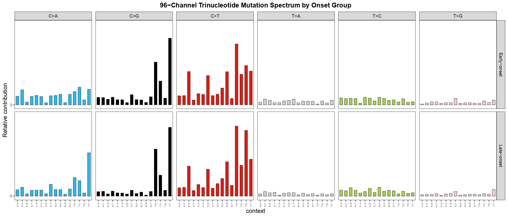
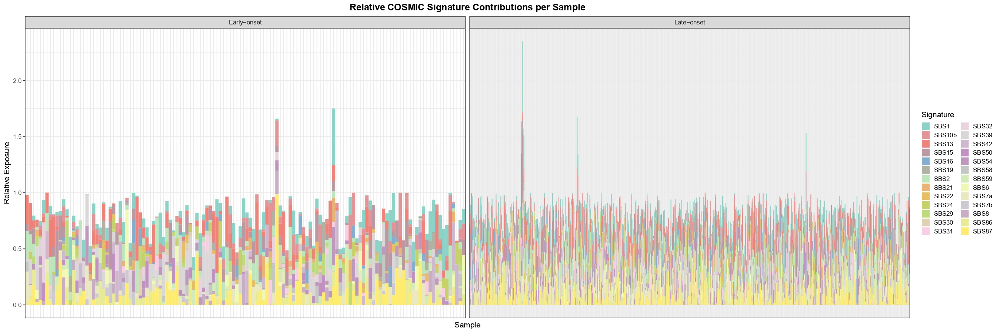
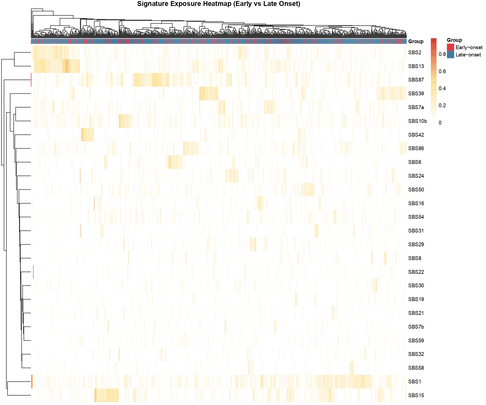
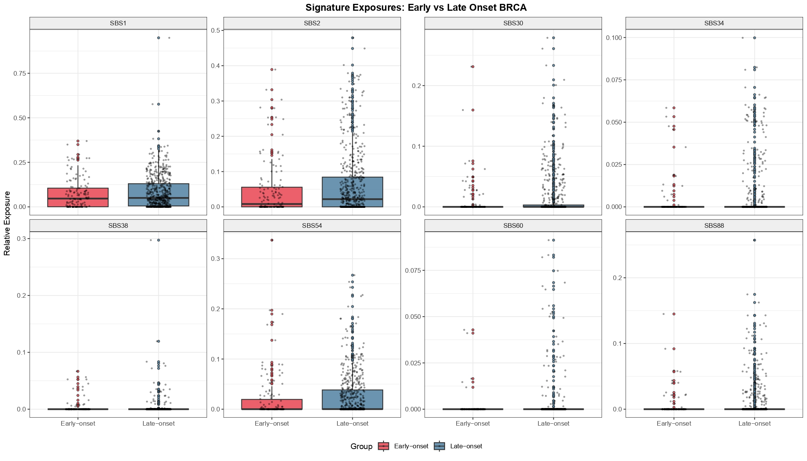
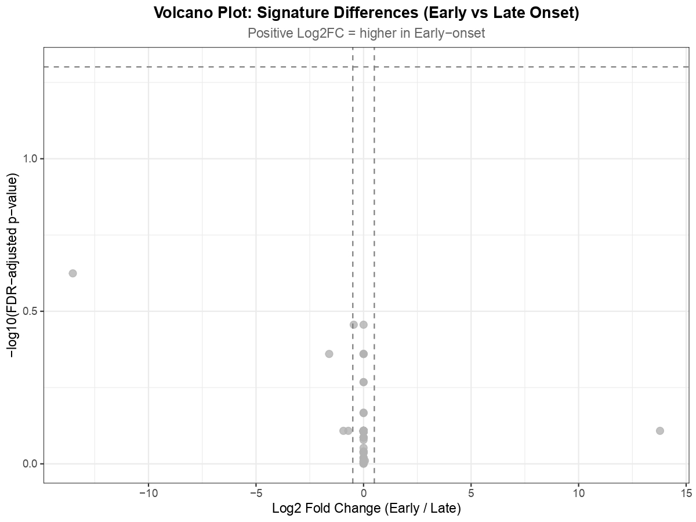
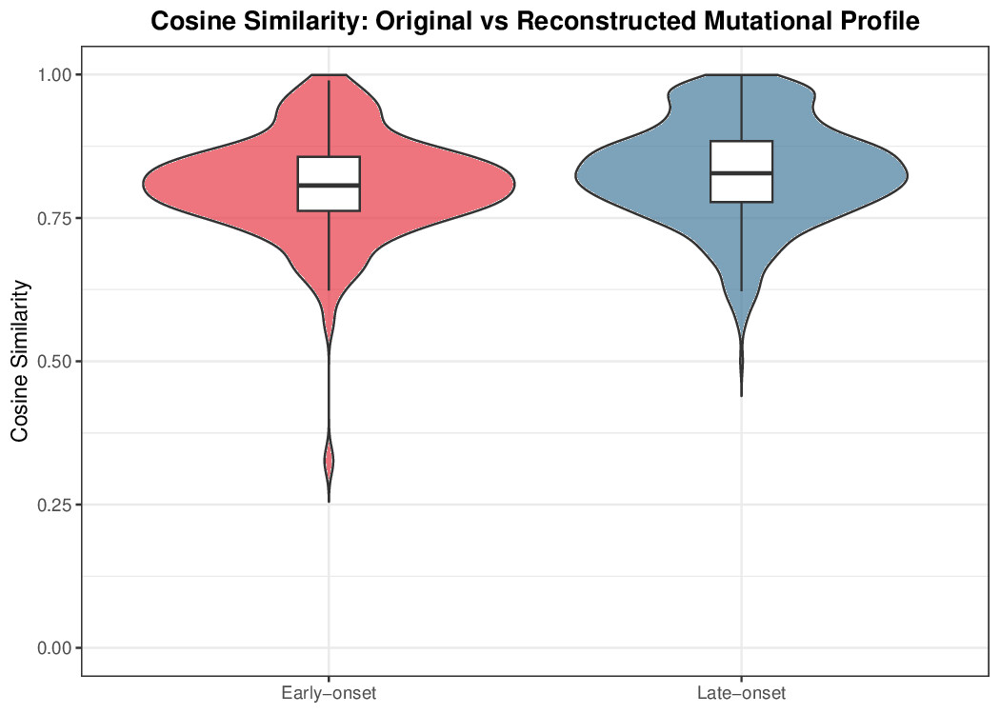

# COSMIC Mutational Signatures in Early-Onset vs Late-Onset Breast Cancer

[](https://www.r-project.org/)
[](https://bioconductor.org/)
[](https://portal.gdc.cancer.gov/)
[](https://cancer.sanger.ac.uk/signatures/)
[](LICENSE)

---

## Biological question

Why do breast cancers diagnosed before age 45 behave clinically differently from those diagnosed after 55, and can we see this difference written into the tumour's DNA?

Every cancer accumulates a distinctive pattern of mutations shaped by the biological processes that drove its growth: DNA repair failures, enzymatic deaminase activity, ageing-related replication errors. These patterns, called **mutational signatures**, act as molecular fingerprints of tumourigenesis, preserved in the tumour genome long after the causative process has ceased. Comparing these fingerprints across age groups offers a window into the distinct aetiological forces operating in young versus older patients.

This question has direct clinical relevance. Early-onset breast cancer is enriched for germline BRCA1/2 mutations and homologous recombination deficiency (HRD), suggesting a different mutagenic biology from the clock-like, replication-error-driven processes that dominate in older patients. If APOBEC-associated or HRD signatures were systematically elevated in young patients, this would have implications for germline testing thresholds, PARP inhibitor eligibility, and the design of age-stratified screening programmes.

This project addresses the question using TCGA-BRCA whole-exome sequencing (WXS) data. Of 992 mutation-annotated samples, 968 could be matched to an age at index; after excluding the intermediate age band (46 to 54), the comparison was performed on **132 early-onset** (age ≤45) and **554 late-onset** (age ≥55) patients.

---

## Key finding

> **After Benjamini-Hochberg FDR correction, no COSMIC signature is significantly differentially active between early-onset and late-onset breast cancer in this cohort. The smallest adjusted p-value across all tested signatures is 0.24 (SBS54), far from the 0.05 threshold.**

This comparison is also statistically underpowered on the early-onset side: at 132 early-onset versus 554 late-onset patients (a roughly 1-to-4 imbalance), combined with the low per-sample mutation counts of WXS, the analysis has limited power to detect a genuine early-onset-specific effect. The null result should therefore be read as "no detectable difference at this sample size and sequencing depth", not as strong evidence that no biological difference exists.

The signatures with appreciable exposure show the following directional patterns, none of which survive correction:

- **SBS1 (clock-like CpG deamination)** is modestly higher in late-onset (median 2.37 vs 1.72; raw p = 0.014, adjusted p = 0.35), directionally consistent with age-correlated accumulation.
- **SBS2 (APOBEC, C>T)** is, contrary to the common expectation, *higher in late-onset* in this cohort (median 0.86 vs 0.28; raw p = 0.040, adjusted p = 0.44), not elevated in early-onset.
- **SBS13 (APOBEC, C>G)** is essentially equal between groups (median 1.19 vs 1.14; raw p = 0.90).

So the data do **not** support the frequently stated hypothesis that APOBEC mutagenesis is elevated in early-onset disease, at least not at the whole-cohort, pooled-subtype level measured here. The HRD signature SBS3 has a median exposure of 0 in both groups (it is essentially undetectable in this WXS refit), so the hypothesised HRD enrichment in early-onset cannot be assessed from these data.

**This null result is scientifically informative, not a failure.** It indicates that:

1. Age-related signature differences, if present, are small relative to within-group biological heterogeneity.
2. Whole-exome sequencing yields too few mutations per sample for reliable multi-signature decomposition (most signatures refit to a median of exactly 0).
3. Pooling across molecular subtypes (ER+, HER2+, TNBC) dilutes any subtype-specific age effect.
4. Subtype-stratified analyses using whole-genome sequencing are needed to resolve the question.

Reproducible negative results are an underrepresented but scientifically essential contribution.

---

## Quantified summary

The seven signatures with the smallest adjusted p-values (none significant):

| Signature | Early median | Late median | Higher in | Raw p | Adjusted p |
|-----------|-------------:|------------:|-----------|------:|-----------:|
| SBS54 | 0.00 | 0.01 | late (negligible) | 0.003 | 0.24 |
| SBS1  | 1.72 | 2.37 | late | 0.014 | 0.35 |
| SBS30 | 0.00 | 0.00 | neither | 0.013 | 0.35 |
| SBS2  | 0.28 | 0.86 | late | 0.040 | 0.44 |
| SBS34 | 0.00 | 0.00 | neither | 0.026 | 0.44 |
| SBS38 | 0.00 | 0.00 | neither | 0.029 | 0.44 |
| SBS88 | 0.00 | 0.00 | neither | 0.035 | 0.44 |

Note that four of these (SBS30, SBS34, SBS38, SBS88) have a median of zero in **both** groups: their small raw p-values arise from sparse non-zero exposures in a handful of low-burden samples, and are best read as refitting noise rather than biological signal. Only SBS1 and SBS2 have a real, interpretable exposure difference, and neither survives FDR correction.

---

## Scientific background (literature expectations)

The table below lists what prior literature would predict. The right-hand column records what this analysis actually found, which diverges from expectation for APOBEC.

| Signature | Process | Literature prediction | This analysis |
|-----------|---------|----------------------|---------------|
| **SBS3**  | Homologous recombination deficiency (HRD) | ↑ Early-onset (BRCA1/2) | Median 0 in both groups; not assessable in WXS refit |
| **SBS2**  | APOBEC cytidine deaminase (C>T) | ↑ Early-onset | Higher in late-onset; not FDR-significant |
| **SBS13** | APOBEC cytidine deaminase (C>G) | ↑ Early-onset | Essentially equal; not significant |
| **SBS5**  | Clock-like replication damage | ↑ Late-onset | Median 0 in both groups; not assessable |
| **SBS1**  | Spontaneous 5mC deamination | ↑ Late-onset | Higher in late-onset (directionally consistent); not FDR-significant |

---

## Repository structure

```
COSMIC-Signatures-EarlyOnset-BRCA/
├── scripts/
│   ├── signature_analysis.R       # Main analysis pipeline
│   ├── plot_signatures.R          # Visualisation script
│   ├── fix_prepare.R              # MAF file ingestion utility
│   └── fix_clinical.R             # Clinical data fetching utility
├── results/
│   ├── plots/                     # plot1..plot6 (.jpg)
│   └── data/
│       ├── maf_combined.rds
│       ├── clinical.rds
│       └── signature_stats_results.csv
├── gdc_tool/                      # GDC Data Transfer Tool + manifest
├── .gitignore
└── README.md
```

---

## Data

| Property | Details |
|----------|---------|
| Project | TCGA-BRCA |
| Data type | Masked Somatic Mutation (WXS) |
| Workflow | Aliquot Ensemble Somatic Variant Merging and Masking |
| Genome build | GRCh38 / hg38 |
| Total samples | 992 |
| Early-onset (≤45) | **132** |
| Late-onset (≥55) | **554** |
| COSMIC version | v3.3.1 SBS signatures |

---

## Reproducing the analysis

```bash
git clone https://github.com/g-Poulami/COSMIC-Signatures-EarlyOnset-BRCA.git
cd COSMIC-Signatures-EarlyOnset-BRCA

# Download 992 TCGA-BRCA MAF files (single-threaded avoids a GDC client
# multiprocessing bug on WSL/Linux)
./gdc_tool/gdc-client download -m gdc_tool/gdc_manifest.txt -n 1

Rscript scripts/fix_prepare.R       # combine MAFs -> results/data/maf_combined.rds
Rscript scripts/fix_clinical.R      # fetch age -> results/data/clinical.rds
Rscript scripts/signature_analysis.R# decomposition + statistics
Rscript scripts/plot_signatures.R   # figures
```

### Dependencies

Bioconductor: `TCGAbiolinks`, `maftools`, `MutationalPatterns`,
`BSgenome.Hsapiens.UCSC.hg38`, `GenomicRanges`, `GenomeInfoDb`, `Biostrings`.
CRAN: `ggplot2`, `dplyr`, `tidyr`, `pheatmap`, `RColorBrewer`, `gridExtra`,
`data.table`, `jsonlite`. System: GDC Data Transfer Tool v1.6.1, R ≥ 4.2,
Bioconductor ≥ 3.17.

---

## Outputs and interpretation

### `signature_stats_results.csv`

Per-signature comparison of exposures between groups: `Early_median`,
`Late_median`, `Log2FC` (Early/Late), `W_statistic`, `P_value`, `P_adj`
(Benjamini-Hochberg).

> **Note on `Log2FC`:** where a group median is 0, the fold change is undefined
> and the reported value (e.g. SBS54 = -13.5, SBS15 = +13.8) is a numerical
> artefact of a near-zero denominator, not a real effect. Treat any `Log2FC`
> derived from a zero median as not interpretable. A cleaner version of the
> pipeline reports these as `NA`.

### Plot 1: 96-channel trinucleotide mutation spectrum



Relative frequency of all 96 single-base-substitution types across six
substitution classes, averaged across early-onset (top) and late-onset (bottom)
patients.

Both groups are dominated by C>T transitions, as expected for breast cancer, and
the two profiles share the same dominant mutational processes, differing only
quantitatively. The trinucleotide differences between groups are small and, as
the statistics confirm, none is robust after correction. (Earlier drafts read a
prominent early-onset C>G / APOBEC signal off this plot; the per-signature
medians do not support that, so the spectra should be read as broadly similar
rather than as showing an APOBEC excess in young patients.)

### Plot 2: stacked bar chart of signature contributions



Per-patient relative signature contributions, split by group. Inter-patient
heterogeneity dominates both groups; no single signature uniformly dominates.
SBS2 and SBS13 (APOBEC) appear prominently in a subset of samples in **both**
groups, confirming that APOBEC activity is sample-specific rather than
age-stratified. Relative exposures above 1.0 in a few samples are NNLS refitting
artefacts in low-burden samples, not biological signal.

### Plot 3: signature exposure heatmap



Hierarchically clustered exposures, with an annotation bar for group. The column
dendrogram does **not** separate early-onset from late-onset samples: the two
groups are thoroughly interleaved, so the global signature profile does not
predict age of onset. Most signatures show near-zero exposure across most
samples, typical of WXS data where per-sample mutation counts are too low to
decompose more than two or three signatures reliably.

### Plot 4: signature boxplots by group



> **Corrected description.** This boxplot shows the signatures with the smallest
> *uncorrected* p-values (SBS1, SBS2, SBS30, SBS34, SBS38, SBS54, SBS60, SBS88).
> **None of these is significant after FDR correction** (smallest adjusted
> p-value overall is 0.24). They are shown to illustrate that even the
> nominally-strongest candidates do not hold up, not because they passed any
> significance threshold.

Reading them: SBS1 and SBS2 are the only two with non-trivial exposure, and both
are higher in late-onset, not early. The remaining signatures (SBS30, SBS34,
SBS38, SBS54, SBS60, SBS88) have medians at or near zero in both groups, so their
small raw p-values reflect refitting noise in sparse, low-burden samples rather
than genuine enrichment. No signature shows a large, clean group separation.

### Plot 5: volcano plot



Each point is a signature: x-axis Log2FC (Early/Late), y-axis -log10(adjusted
p). **No point crosses the FDR = 0.05 line**, which is the central result. Points
with extreme |Log2FC| arise from near-zero denominator medians (see the Log2FC
note above) and are not genuine effects.

### Plot 6: cosine similarity (reconstruction quality)



How well COSMIC v3.3.1 reconstructs each sample's observed profile. Values above
0.9 indicate adequate fitting; values below 0.8 flag samples with too few
mutations for reliable decomposition or processes not captured by COSMIC v3.3.1.

---

## Discussion

### What the data show

After FDR correction, there are no significant differences in COSMIC signature
exposures between early-onset and late-onset breast cancer (smallest adjusted
p = 0.24). Among the signatures with real exposure, SBS1 (clock-like) is
directionally higher in late-onset, consistent with expectation, while SBS2
(APOBEC) is also higher in late-onset, which runs counter to the common
hypothesis of APOBEC enrichment in early-onset disease. SBS13 is flat. The
heatmap confirms that onset age does not stratify tumours into distinct
mutational subgroups. Taken together, age at onset, considered independently of
molecular subtype, is a weak predictor of COSMIC signature composition in this
cohort, and the specific APOBEC-in-early hypothesis is not supported here.

### Why the null result is informative

1. **Power limitation of WXS:** exome sequencing captures ~2% of the genome;
   per-sample mutation counts are too low to decompose more than two or three
   signatures reliably, which is why most signatures refit to a median of 0.
2. **Subtype heterogeneity as a confounder:** pooling ER+, HER2+, and TNBC may
   dilute a subtype-specific age effect (for example HRD/SBS3 enrichment
   concentrated in TNBC) to non-significance.
3. **Small effect sizes relative to inter-patient variance:** breast cancer is
   heterogeneous; detecting a modest age signal needs larger samples or reduced
   variance via stratification.
4. **Age cutoffs:** the ≤45 / ≥55 design maximises contrast but reduces sample
   size and still admits aetiologically heterogeneous tumours within each group.

### Recommended next steps

- Subtype-stratified analysis, TNBC separately (most enriched for BRCA1/2 and HRD).
- Whole-genome sequencing for higher mutation counts and reliable HRD/SBS3 fitting.
- Germline BRCA1/2 status as a covariate to test HRD enrichment directly.
- Larger external cohorts (METABRIC, ICGC) for power.

---

## Limitations

- **Group imbalance and small early-onset arm.** The early-onset group (n = 132) is roughly a quarter the size of the late-onset group (n = 554), reducing power to detect early-onset-specific signatures even where one exists.
- WXS only; whole-genome data would give higher mutation counts and more reliable
  signature fitting. Most signatures here refit to a median of 0, limiting what
  can be concluded.
- The Mann-Whitney U test does not account for tumour purity, subtype
  (ER+/HER2+/TNBC), or batch effects.
- COSMIC refitting assumes all mutations come from known signatures; novel or
  composite processes may be misattributed, and sparse exposures may be noise.
- `Log2FC` values derived from a zero group median are numerical artefacts and
  are not interpretable.
- Age cutoffs (≤45 / ≥55) exclude intermediate-age patients.
- Germline BRCA1/2 status was not available as a covariate.

---

## References

1. Alexandrov et al. (2020). The repertoire of mutational signatures in human cancer. *Nature*, 578, 94-101.
2. COSMIC Mutational Signatures v3.3.1. https://cancer.sanger.ac.uk/signatures/
3. Blokzijl et al. (2018). MutationalPatterns. *Genome Medicine*, 10, 33.
4. Colaprico et al. (2016). TCGAbiolinks. *Nucleic Acids Research*, 44(8), e71.
5. Mayakonda et al. (2018). Maftools. *Genome Research*, 28, 1747-1756.
6. Burns et al. (2013). APOBEC3B is an enzymatic source of mutation in breast cancer. *Nature Genetics*, 45, 229-233.
7. Tutt et al. (2021). Adjuvant olaparib for BRCA1/2-mutated breast cancer. *New England Journal of Medicine*, 384, 2394-2405.

---

## Author

**Poulami Ghosh**, [@g-Poulami](https://github.com/g-Poulami) · [LinkedIn](https://linkedin.com/in/poulami-ghosh-879439304) · poulamighosh738@gmail.com

## License

Apache License, Version 2.0. See [LICENSE](LICENSE).
